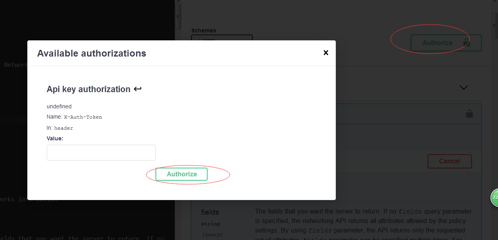
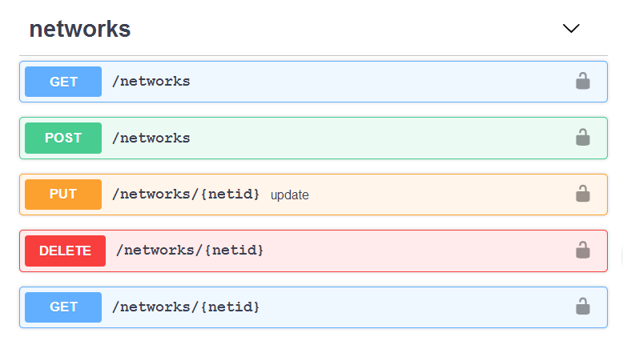
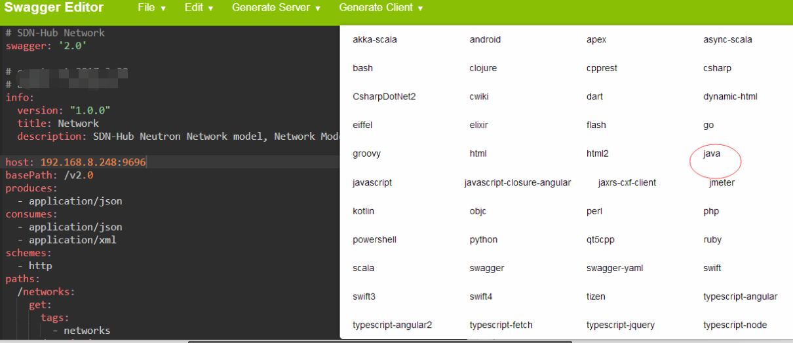

# objective

I want to use swagger to build openstack sdks for many languages supported by swagger client tools.

# structure

this repo has many folders, one folder is a component in openstack.

# instruction
* input your token from keystone service


* try your api request, fill in your query parameter or request body to check the response



* get your favourite sdks, in fact, you already get best python sdk for openstack from openstack source code, but you can get as u wish, for example java sdk for openstack rest apis.





* for starters about swagger tools, you can run the below to access the swagger editor

```
docker pull swaggerapi/swagger-editor
docker run -p 80:8080 swaggerapi/swagger-editor
```

and then you open your browser visit localhost:80 to get the swagger ui shown above
# wishes

hope many people contribute to this project, so that people will get many different languages sdks for your work around openstack rest api

# convention
I hope everything is free style, you can put all api yamls in one file or just like what I did in neutron folder, there is firewall.yaml, network.yaml, subnet.yaml etc. once you find  it is not easy to write different model dependencies  , you can feel free to put them into one file, for swagger is not supporting reference yaml code(model definition) across other files now.

# CI
this repo just holds swagger yaml files, which u can paste to swagger editor to get a gui to fetch your client sdk that you want, later on, when I get more money I will run a CI to eheck the syntax of swagger yaml.

 

# acknowledgement

thanks to swagger team, it is a greate  idea for rest api skds and visualization and edit and so on....

thank you so much